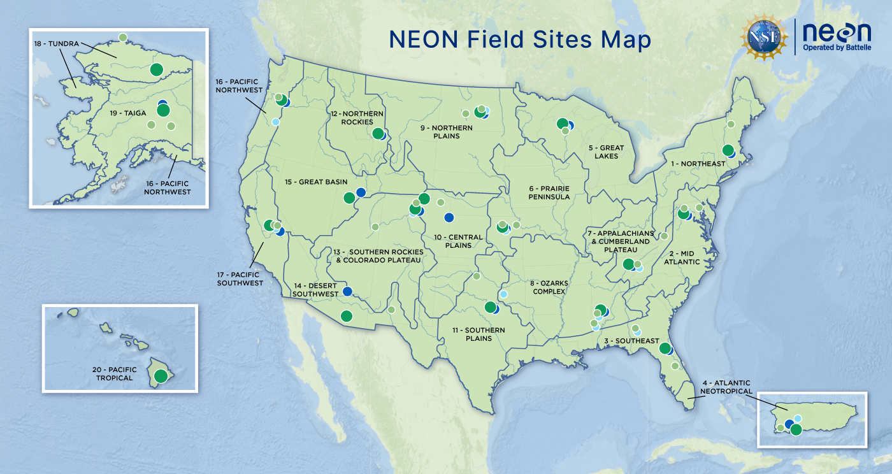
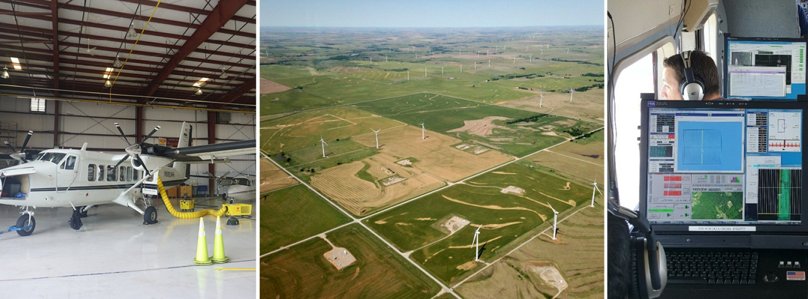
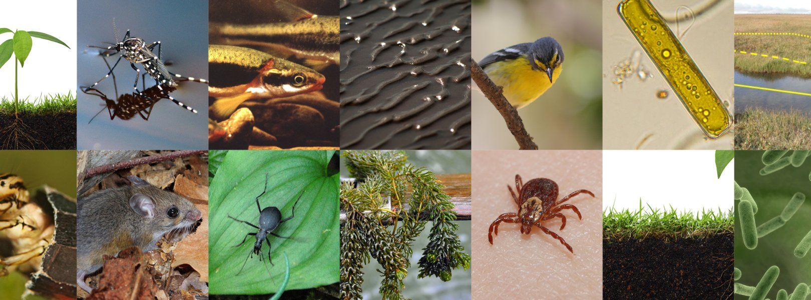
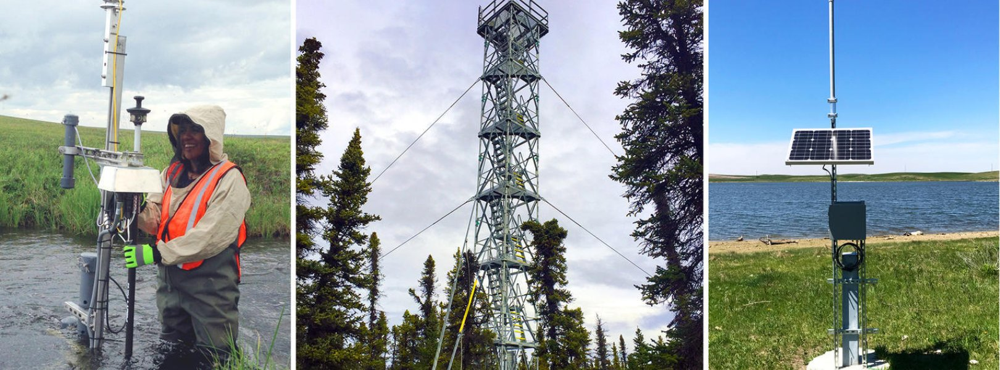

# What is NEON?

NEON is a continental-scale observation facility designed to collect long-term open-access ecological data to better understand the complexities of Earth's ecosystems and how they are changing. NEON uses cutting-edge sensor networks, instrumentation, observational sampling, natural history archive facilities and remote sensing methods and technologies to collect data on plants, animals, soil, nutrients, freshwater and the atmosphere.

NEON operates 81 [field sites](https://www.neonscience.org/field-sites/about-field-sites) strategically located across 20 ecoclimatic Domains across the United States, including 47 terrestrial sites and 34 freshwater aquatic sites. When logistically possible, aquatic and terrestrial field sites are colocated (i.e. in close proximity) to support understanding of linkages across terrestrial and aquatic ecosystems and their interactions with the atmosphere. For example, Domain 08, the Ozarks Complex, has three co-located sets of terrestrial and aquatic field sites. These sites are situated along the same watershed system, creating a unique opportunity to study hydrology, nutrient transport, and biogeochemical cycling through the watershed.

<figure markdown>
  { width="750" }
  <figcaption>NEON Field Sites Map - Green: Terrestrial Sites, Blue: Aquatic Sites</figcaption>
</figure>

NEON delivers data products from three main sub-systems called the **Airborne Observation Platform (AOP)**, Terrestrial and Aquatic Observational Systems (TOS/AOS), and the Instrumented Systems (TIS/AIS). The section below provides a brief summary of these sub-systems.

## NEON Airborne Observation Platform (AOP)

<figure markdown>
  { width="750" }
  <figcaption>NEON Airborne Remote Sensing</figcaption>
</figure>

Airborne remote sensing surveys are conducted over NEON field sites during peak greenness and provide quantitative information on land cover and changes to ecological structure and chemistry, including the presence and effects of invasive species. The surveys are supported by the NEON Airborne Observation Platform (AOP), a suite of earth observation instruments installed into a Twin Otter aircraft designed to collect high-resolution remote sensing data at low altitude. AOP was designed to collect regional-scale landscape information at the NEON field sites. The AOP maps areas where NEON's observational and instrumented sampling is occurring and allows relationships to be drawn between NEON's detailed in-situ observations to the broader environmental and ecological conditions.

!!! info "Learn More"
    Please see the next section [Airborne Observation Platform](aop.md) for more details on the AOP including a summary of the data products provided.

## NEON Field Data

In addition to the AOP remote sensing data, NEON also provides [Observational Sampling (OS)](https://www.neonscience.org/data-collection/observational-sampling) data and [Instrumented Sampling (IS)](https://www.neonscience.org/data-collection/automated-instruments) data at terrestrial and aquatic sites. The field and instrumented sampling are briefly described below, but we encourage exploring the NEON website further for a more detailed understanding of the sensors and data products provided by the OS and IS groups.

### Observational Sampling

<figure markdown>
  { width="750" }
  <figcaption>NEON Observational Samples</figcaption>
</figure>

NEON field scientists collect a broad variety of observations and samples at terrestrial and aquatic field sites at regular intervals throughout the year. The data and samples collected by NEON's Aquatic Observation System (AOS) and Terrestrial Observation System (TOS) are designed to provide standardized, continentally distributed observations of organisms, biogeochemistry, and physical properties.

### Instrumented Sampling

<figure markdown>
  { width="750" }
  <figcaption>NEON Instrumented Sampling</figcaption>
</figure>

NEON deploys automated instruments to collect [meteorological](https://www.neonscience.org/data-collection/meteorology), [soil](https://www.neonscience.org/data-collection/soil-sensors), [phenological](https://www.neonscience.org/data-collection/phenocams), [surface water](https://www.neonscience.org/data-collection/surface-water), and [groundwater](https://www.neonscience.org/data-collection/groundwater) data at NEON field sites.

!!! note "Colocated Sites"
    Where logistically possible, NEON colocated aquatic sites with terrestrial sites (21 in total) to support an understanding of linkages across atmospheric, terrestrial, and aquatic ecosystems. The suite of OS, IS, and AOP data provide an unparalleled opportunity to study ecosystem-level change over time in the United States.