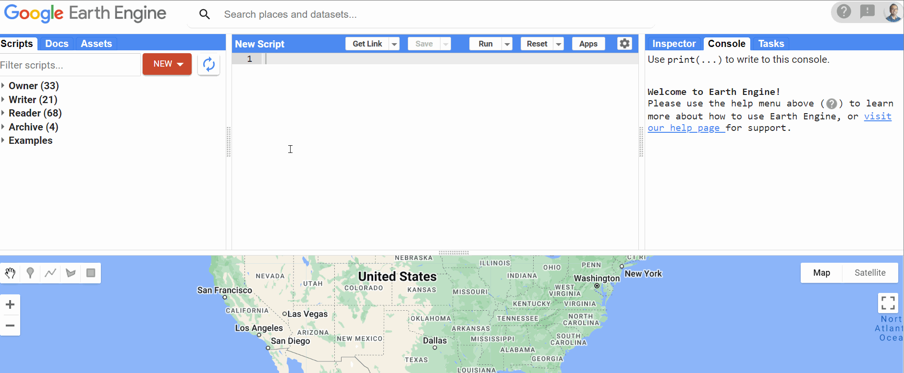

# Earth Engine Data Catalog <small>90+ Petabytes of Geospatial Data</small>

!!! info "Catalog Overview"

    **1000+ datasets** • **90+ petabytes** of data • **Continuously updated** • **Free access** to most datasets

The Earth Engine data catalog represents one of the world's largest collections of publicly available geospatial datasets. Originally designed around primary datasets curated by the Earth Engine team, the catalog has grown into a comprehensive repository that democratizes access to satellite imagery, climate data, and geophysical datasets from around the globe.

<figure markdown>
  { width="100%" }
  <figcaption>Exploring the Earth Engine Data Catalog interface</figcaption>
</figure>

## Dataset Categories

The catalog spans multiple domains of Earth observation and environmental monitoring:

=== "Satellite Imagery"
    - **Landsat Collection** - 50+ years of Earth observation
    - **Sentinel Series** - High-resolution European Space Agency data
    - **MODIS** - Daily global coverage for environmental monitoring
    - **Planet** - High-frequency, high-resolution commercial imagery

=== "Climate & Weather"
    - **ERA5 Reanalysis** - Comprehensive atmospheric data
    - **CHIRPS** - Precipitation datasets for climate monitoring
    - **Temperature Records** - Historical and real-time temperature data
    - **Weather Station Data** - Ground-based meteorological observations

=== "Terrain & Topography"
    - **SRTM** - Global digital elevation models
    - **ASTER GDEM** - High-resolution terrain data
    - **Global Forest Change** - Annual forest loss and gain
    - **Land Cover Classifications** - Multiple global and regional products

=== "Environmental"
    - **Air Quality** - Pollution and atmospheric composition
    - **Ocean Data** - Sea surface temperature, salinity, currents
    - **Biodiversity** - Species distribution and habitat data
    - **Urban Development** - Built environment and infrastructure

## Finding Your Data

### Quick Search Methods

!!! tip "Search Strategies"

    **🔍 By Keywords**: Use terms like "landsat", "temperature", "precipitation"

    **🗓️ By Date Range**: Filter datasets by temporal coverage

    **🌍 By Geographic Area**: Search for region-specific datasets

    **📊 By Data Type**: Filter by imagery, tables, or image collections

<figure markdown>
  { width="100%" }
  <figcaption>Searching for datasets directly in the Earth Engine Code Editor</figcaption>
</figure>

### Access Points

!!! note "Where to Find Data"

    🌐 **[Main Catalog Browser](https://developers.google.com/earth-engine/datasets)** - Web-based dataset explorer

    📋 **[Complete Dataset List](https://developers.google.com/earth-engine/datasets/catalog)** - All available datasets in one view

    💻 **Code Editor Search** - Built-in search within the development environment

    📖 **[Dataset Tags](https://developers.google.com/earth-engine/datasets/tags)** - Browse by thematic categories

### Specialized Collections

!!! example "Domain-Specific Highlights"

    **🌱 Agriculture**: Crop type maps, NDVI time series, soil moisture

    **🏙️ Urban Planning**: Nighttime lights, population density, built-up areas

    **🌊 Water Resources**: Surface water occurrence, flood mapping, water quality

    **🔥 Disaster Response**: Fire detection, damage assessment, emergency mapping

## Data Licensing and Usage

### Understanding Access Rights

!!! warning "Important Licensing Information"

    - **Most datasets are free** for research and non-commercial use
    - **Commercial datasets** require specific licensing (clearly marked)
    - **Citation requirements** vary by dataset - check individual dataset pages
    - **Usage limits** may apply to some high-resolution commercial data

### Best Practices

=== "Before Using Data"
    1. **Read the dataset description** thoroughly
    2. **Check temporal and spatial coverage** for your area of interest
    3. **Review licensing terms** and citation requirements
    4. **Understand data quality** and known limitations

=== "For Reproducible Research"
    1. **Document dataset versions** and access dates
    2. **Include proper citations** in publications
    3. **Note any preprocessing** applied to the data
    4. **Share your analysis code** when possible

## Advanced Catalog Features

### Programmatic Access

For power users and automated workflows, the catalog can be accessed programmatically:

- **Earth Engine API** - Direct dataset access through code
- **Asset Management** - Import and manage your own datasets
- **Shared Assets** - Access community-contributed datasets
- **Apps Integration** - Use catalog data in Earth Engine Apps
