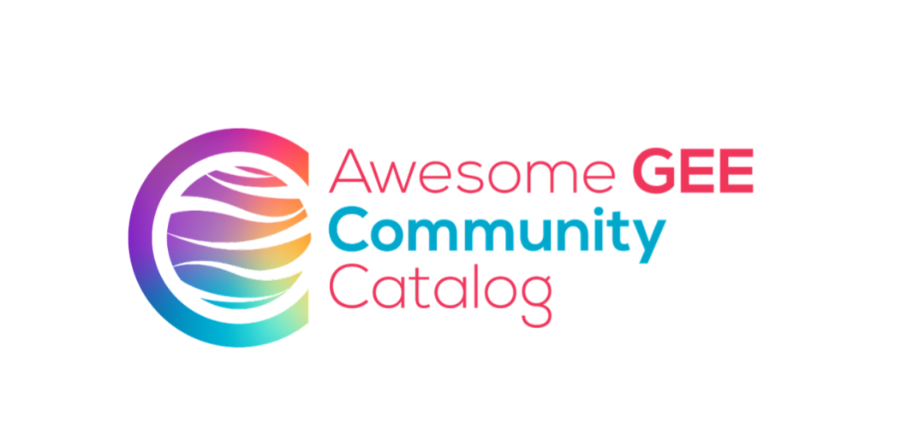

# Awesome GEE Community Catalog <small>Community-Driven Geospatial Datasets</small>

!!! info "Community-Powered Data Commons"

    **Community-sourced** datasets • **Open licenses** • **Ready-to-use** Earth Engine assets • **Preprocessed** for immediate analysis

The [Awesome GEE Community Catalog](https://gee-community-catalog.org/) represents a grassroots effort to democratize access to geospatial data. This community-driven repository addresses a critical gap: research datasets that often require extensive preprocessing before they can be used in Google Earth Engine. By providing ready-to-use Earth Engine assets, the catalog eliminates barriers and accelerates research workflows.

<figure markdown>
  { width="60%" }
  <figcaption>Awesome GEE Community Catalog - Bridging data gaps through community collaboration</figcaption>
</figure>

!!! note "Project Origins"

    📖 **Learn More**: [Community Datasets: Data Commons in Google Earth Engine](https://medium.com/geospatial-processing-at-scale/community-datasets-data-commons-in-google-earth-engine-8585d8baef1f)

    The project emerged from the recognition that many valuable research datasets remained inaccessible due to preprocessing complexity, licensing confusion, or format incompatibilities.

## Why Community Catalog Matters

### Addressing Real Challenges

=== "Data Accessibility"
    - **Preprocessing Barriers** - Complex datasets made analysis-ready
    - **Format Standardization** - Consistent Earth Engine asset formats
    - **Documentation** - Clear metadata and usage examples
    - **Quality Assurance** - Community-validated datasets

=== "Open Science"
    - **Open Licenses** - Transparent usage rights
    - **Reproducible Research** - Standardized data access
    - **Community Validation** - Peer-reviewed quality
    - **Knowledge Sharing** - Collaborative improvement

=== "Research Acceleration"
    - **Immediate Access** - Skip time-consuming preprocessing
    - **Tested Examples** - Working code for quick starts
    - **Domain Organization** - Intuitive dataset discovery
    - **Regular Updates** - Community-maintained freshness

## Dataset Categories

The catalog organizes datasets into thematic domains for intuitive discovery:

### Core Domains

| Domain | Focus Areas | Example Datasets |
|--------|-------------|------------------|
| **🏙️ Population & Socioeconomics** | Demographics, economic indicators, urban development | Population grids, poverty maps, economic activity |
| **🌱 Agriculture & Food Security** | Crop mapping, yield prediction, food systems | Crop type maps, agricultural statistics, food prices |
| **🌊 Hydrology & Water Resources** | Water availability, quality, infrastructure | River networks, water bodies, groundwater data |
| **🔥 Disasters & Hazards** | Risk assessment, emergency response | Flood maps, fire perimeters, vulnerability indices |
| **🌿 Ecology & Biodiversity** | Species distribution, habitat mapping | Protected areas, species occurrence, ecosystem maps |
| **🏗️ Infrastructure & Transportation** | Built environment, connectivity | Road networks, building footprints, facility locations |

### Specialized Collections

!!! example "Unique Dataset Highlights"

    **🛰️ Radar & SAR Data** - Preprocessed radar datasets for advanced analysis

    **📊 Statistical Surfaces** - Gridded statistical data from national surveys

    **🗺️ Administrative Boundaries** - High-quality boundary datasets for multiple countries

    **⏰ Historical Archives** - Digitized historical maps and imagery

## Navigating the Catalog

### Discovery Methods

<figure markdown>
  { width="100%" }
  <figcaption>Exploring datasets by thematic domains - expand categories to discover relevant datasets</figcaption>
</figure>

!!! tip "Finding the Right Dataset"

    **📂 Browse by Domain** - Expand thematic categories to explore related datasets

    **🔍 Keyword Search** - Use the search bar for specific terms, tags, or dataset names

    **🏷️ Tag Filtering** - Combine multiple tags to narrow your search

    **📋 Asset Lists** - Each dataset page shows all available Earth Engine assets

<figure markdown>
  { width="100%" }
  <figcaption>Using the search functionality to quickly find datasets by name, keywords, or tags</figcaption>
</figure>

### Dataset Pages

Each dataset in the catalog provides comprehensive information:

=== "Essential Information"
    - **Dataset Description** - Comprehensive overview and methodology
    - **Spatial/Temporal Coverage** - Geographic extent and time range
    - **Data Source** - Original data providers and processing details
    - **Licensing Information** - Clear usage rights and restrictions

=== "Technical Details"
    - **Earth Engine Asset IDs** - Direct links to data assets
    - **Coordinate Reference System** - Projection and datum information
    - **Resolution Specifications** - Spatial and temporal resolution
    - **Data Quality Notes** - Known limitations and considerations

=== "Usage Resources"
    - **Example Code** - Working JavaScript and Python examples
    - **Visualization Parameters** - Pre-configured display settings
    - **Processing Tips** - Best practices for analysis
    - **Citation Guidelines** - Proper attribution requirements

## Integration with Earth Engine

### Code Editor Repository

<figure markdown>
  { width="100%" }
  <figcaption>Adding the community catalog repository to your Earth Engine Code Editor for easy access</figcaption>
</figure>

!!! success "Easy Integration"

    **🔗 Add Repository**: Include the entire catalog as a Code Editor repository

    **📱 Quick Access**: Browse examples directly in your development environment

    **🔄 Automatic Updates**: Stay current with new datasets and improved examples

    **💻 Ready-to-Run Code**: Copy and modify examples for your specific needs

### Working with Community Datasets

```javascript
// Example: Loading a community dataset
var populationGrid = ee.Image('projects/sat-io/open-datasets/worldpop/ppp_2020_1km_Aggregated');

// Apply filtering and visualization
var visualization = {
  min: 0,
  max: 1000,
  palette: ['white', 'yellow', 'orange', 'red', 'purple']
};

Map.addLayer(populationGrid, visualization, 'Population Density 2020');
```

!!! tip "Best Practices for Community Data"

    ⚡ **Check Asset Status** - Verify asset availability before deployment

    📖 **Read Documentation** - Understand processing methodology and limitations

    🏷️ **Use Proper Citations** - Credit original data providers and catalog contributors

    🔄 **Stay Updated** - Monitor for dataset updates and improvements

## Contributing to the Catalog

### How to Get Involved

!!! info "Community Participation"

    The catalog thrives on community contributions. Here's how you can help:

=== "Data Contributors"
    - **Submit Datasets** - Share your preprocessed research datasets
    - **Improve Documentation** - Enhance existing dataset descriptions
    - **Validate Quality** - Test and verify dataset accuracy
    - **Update Examples** - Improve or add new code examples

=== "Technical Contributors"
    - **Code Development** - Enhance catalog infrastructure
    - **Bug Reporting** - Identify and report issues
    - **Feature Requests** - Suggest new functionality
    - **Testing** - Validate new features and datasets

=== "Community Support"
    - **User Feedback** - Share experiences and suggestions
    - **Documentation** - Improve tutorials and guides
    - **Outreach** - Promote catalog usage in your networks
    - **Training** - Help others learn to use community datasets

### Contribution Guidelines

!!! warning "Quality Standards"

    **📋 Documentation Required** - Complete metadata and usage examples

    **⚖️ Open Licensing** - Datasets must use open, clearly specified licenses

    **🔍 Quality Assurance** - Data must be validated and tested

    **🤝 Community Review** - Submissions undergo peer review process

## Impact and Recognition

### Growing Ecosystem

The Awesome GEE Community Catalog has become an essential resource for the Earth Engine community:

- **🌍 Global Reach** - Used by researchers and practitioners worldwide
- **📈 Growing Collection** - Continuously expanding dataset portfolio
- **🎓 Educational Value** - Supporting teaching and learning initiatives
- **🔬 Research Enablement** - Accelerating scientific discoveries

### Academic Citation

When using datasets from the community catalog, please cite both the original data source and the catalog project:

!!! quote "Citation Format"

    Roy, S., & Swetnam, T. (2024). samapriya/awesome-gee-community-datasets: Community Catalog (2.6.0). Zenodo. https://doi.org/10.5281/zenodo.11118613

## Getting Started

### Quick Start Guide

1. **🌐 Explore the Catalog** - Visit [gee-community-catalog.org](https://gee-community-catalog.org/)
2. **🔍 Find Your Data** - Use search or browse by domain
3. **📖 Read Documentation** - Understand dataset specifications and limitations
4. **💻 Try Examples** - Run provided code in Earth Engine Code Editor
5. **🚀 Build Your Analysis** - Adapt examples for your research needs

### Next Steps

!!! tip "Maximize Your Impact"

    **🤝 Join the Community** - Engage with other users and contributors

    **📢 Share Your Work** - Showcase analyses built with community datasets

    **🔄 Give Feedback** - Help improve datasets and documentation

    **📚 Stay Informed** - Follow updates and new dataset announcements

---

*The Awesome GEE Community Catalog represents the power of collaborative science - join the community and help democratize access to geospatial data.*
