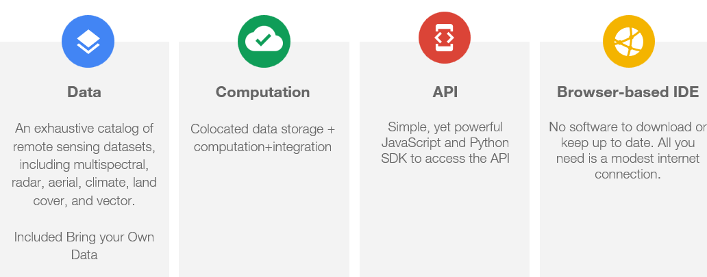
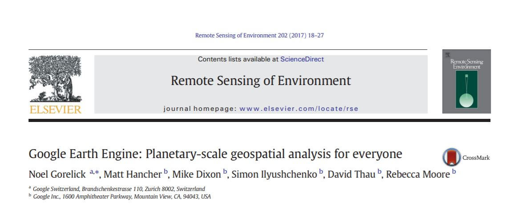

# Google Earth Engine <small>Browser Based Remote Sensing</small>

!!! info "Key Benefits"

    **90+ petabytes** of open geospatial data • **Cloud-based processing** • **JavaScript & Python SDKs** • **Scalable analysis** from local to global

Google Earth Engine brings the power of remote sensing analysis into the browser. With just an internet connection, anyone can tap into this cloud-based platform to process and query massive geospatial datasets.

Earth Engine levels the playing field for working with satellite imagery and raster data at scale. It hosts one of the largest repositories of open geospatial assets (over 90+ petabytes), while ingesting new data continuously. Users can perform analysis across these indexed layers, going from local to global, using JavaScript and Python SDKs. The cloud infrastructure allows researchers to iterate rapidly and run computations on petabytes of data. Results are shareable, published outputs that ensure reproducibility. Earth Engine simplifies the process from data access to analysis to dissemination.

<figure markdown>
  { width="100%" }
  <figcaption>What is Google Earth Engine</figcaption>
</figure>

!!! tip "Why Earth Engine Matters"

    By moving most of the processing into the cloud, Earth Engine makes remote sensing more accessible. Users now wield these capabilities through any web browser. This democratization of geospatial analytics opens up new possibilities for applications across numerous domains.

## Capabilities and Limitations

Understanding what Google Earth Engine excels at—and where it has boundaries—helps you make the most of this powerful platform.

### :material-check-circle: What Earth Engine Does Best

=== "Image Processing"
    - Map Algebra, Kernels and Convolutions
    - Spectral Unmixing, Pan-sharpening
    - Gap Filling, Data Fusion

=== "Vector Processing"
    - Zonal Statistics, Spatial Joins
    - Spatial Query operations

=== "Terrain Analysis"
    - Slope, Aspect, Hillshades
    - Hill Shadow Analysis

=== "Time Series"
    - Extract Time-Series, Trend Analysis
    - Time-Series Smoothing
    - Temporal Segmentation

=== "Advanced Analytics"
    - Object-based Image Analysis (GLCM, Texture, Hotspots)
    - Change Detection (Spectral Distance, Change Classification)
    - Machine Learning (Supervised/Unsupervised Classification, PCA)
    - Deep Learning (DNN, Object Detection via TensorFlow)

### :material-alert-circle: Current Limitations

!!! warning "Not supported in Earth Engine"

    - **Cartographic Outputs** - No traditional map layout tools
    - **3D Visualization** - Limited to 2D analysis and display
    - **Hydrological Modeling** - No rainfall-runoff or watershed tools
    - **Photogrammetry** - No orthorectification or point cloud processing
    - **LiDAR Processing** - No specialized LiDAR analysis tools
    - **SAR Interferometry** - Limited SAR analysis capabilities

## Additional Resources

!!! note "Learn More"

    📄 **Research Paper**: [Google Earth Engine: Planetary-scale geospatial analysis for everyone](https://www.sciencedirect.com/science/article/pii/S0034425717302900)

    📚 **Comprehensive Guide**: [Cloud-Based Remote Sensing with Google Earth Engine: Fundamentals and Applications](https://link.springer.com/book/10.1007/978-3-031-26588-4) - Open source book by the GEE community

<figure markdown>
  { width="80%" }
  <figcaption>Snippet from the Google Earth Engine main paper. <a href="https://www.sciencedirect.com/science/article/pii/S0034425717302900">Source</a></figcaption>
</figure>
